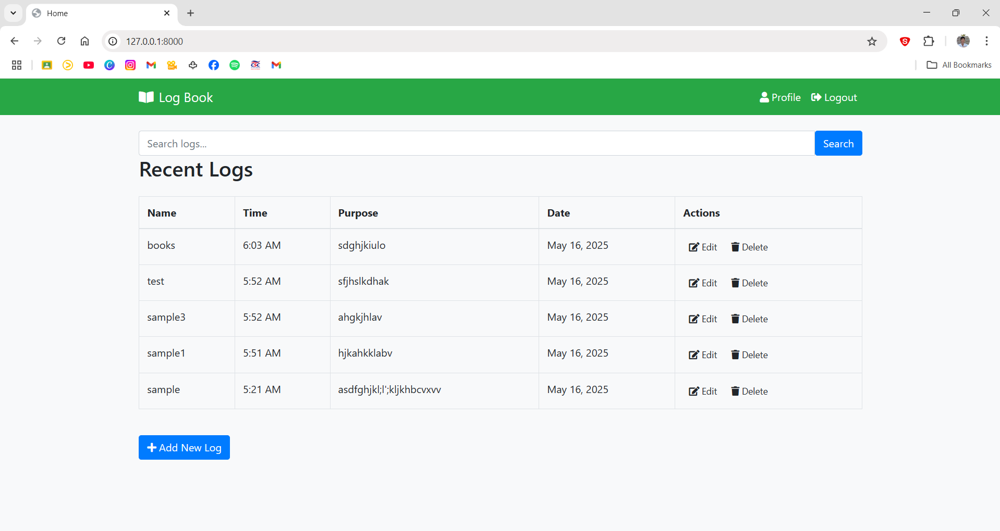
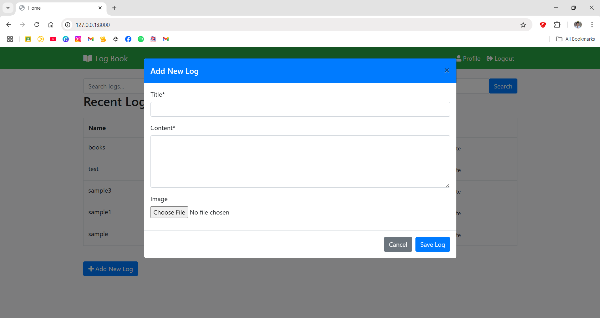
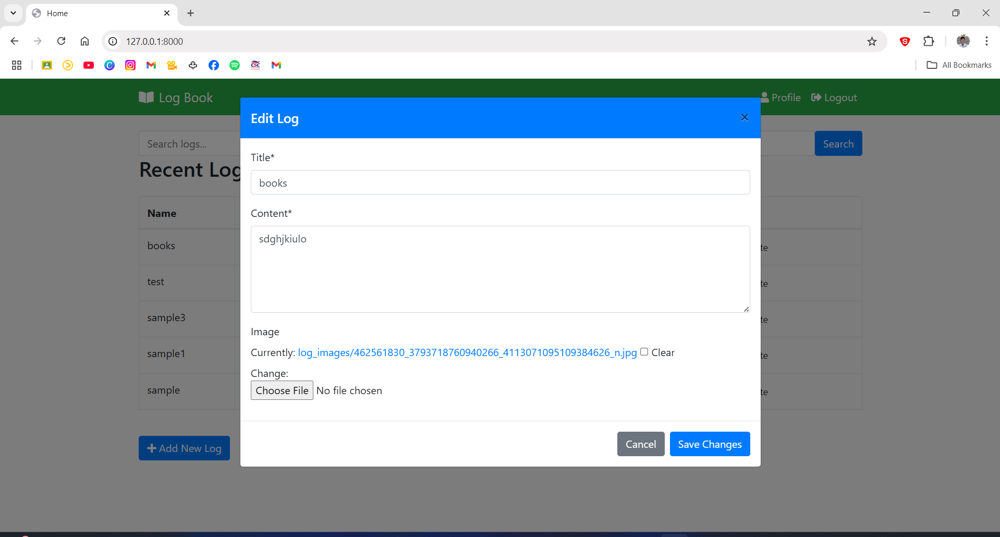

# Django Logbook Project

A modern and user-friendly logbook application built with Django, featuring a clean UI and modal-based interactions.

🔗 [View Live Demo](https://github.com/Ichie2000/Log-Book-CRUD)

## Features

- 🔐 **User Authentication**
  - Secure login system
  - Profile management with modal dialog
  - Logout confirmation

- 📝 **Log Management**
  - Create new logs with modal form
  - Edit existing logs in-place
  - Delete logs with confirmation
  - File attachments support

- 🎨 **Modern UI/UX**
  - Bootstrap 4 styling
  - Modal-based forms for smoother interaction
  - Responsive design for mobile devices
  - Font Awesome icons
  - Clean and intuitive interface

- ⚡ **Technical Features**
  - AJAX form submissions
  - Real-time form validation
  - File upload handling
  - MySQL database backend
  - Django messages framework integration

## Screenshots

### List View with Search

*Clean and modern login interface*

### Add

*Main dashboard showing logs list*

### Edit

*Modal dialog for creating new logs*

### Delete Confirmation

*User profile management modal*

## Installation

1. Clone the repository:
   ```bash
   git clone https://github.com/Ichie2000/Log-Book-CRUD.git
   cd Log-Book-CRUD
   ```

2. Create and activate a virtual environment:
   ```bash
   python -m venv venv
   
   # On Windows:
   .\venv\Scripts\activate
   
   # On Unix or MacOS:
   source venv/bin/activate
   ```

3. Install required packages:
   ```bash
   pip install -r requirements.txt
   ```

4. Create a `.env` file in the project root with your database settings:
   ```
   DB_NAME=logbook
   DB_USER=your_database_user
   DB_PASSWORD=your_database_password
   DB_HOST=localhost
   DB_PORT=3306
   SECRET_KEY=your-secret-key-here
   ```

5. Run database migrations:
   ```bash
   python manage.py migrate
   ```

6. Create a superuser (admin):
   ```bash
   python manage.py createsuperuser
   ```

7. Start the development server:
   ```bash
   python manage.py runserver
   ```

8. Visit http://127.0.0.1:8000/ in your web browser

## Project Structure

```
django_logbook/
├── logbook/                 # Main application
│   ├── migrations/         # Database migrations
│   ├── static/            # Static files (CSS, JS)
│   ├── templates/         # HTML templates
│   ├── forms.py          # Form definitions
│   ├── models.py         # Database models
│   ├── urls.py           # URL configurations
│   └── views.py          # View logic
├── static/                # Project-wide static files
├── media/                 # User-uploaded files
├── manage.py             # Django management script
├── requirements.txt      # Python dependencies
└── .env                  # Environment variables
```

## Technologies Used

- **Backend**: Django 4.2
- **Frontend**: Bootstrap 4, jQuery, Font Awesome
- **Database**: MySQL
- **Additional**: 
  - django-crispy-forms
  - python-dotenv
  - Pillow (for image handling)

## Contributing

1. Fork the repository
2. Create your feature branch (`git checkout -b feature/AmazingFeature`)
3. Commit your changes (`git commit -m 'Add some AmazingFeature'`)
4. Push to the branch (`git push origin feature/AmazingFeature`)
5. Open a Pull Request

## License

This project is licensed under the MIT License - see the [LICENSE](LICENSE) file for details.

## Acknowledgments

- Bootstrap for the amazing UI components
- Font Awesome for the beautiful icons
- Django community for the excellent documentation

## Author

👤 **Ichie2000**

* GitHub: [@Ichie2000](https://github.com/Ichie2000)
* Repository: [Log-Book-CRUD](https://github.com/Ichie2000/Log-Book-CRUD)

## Deployment

### Deploy to PythonAnywhere (Free)

1. Sign up for a free account at [PythonAnywhere](https://www.pythonanywhere.com)

2. Upload your code:
   ```bash
   # On PythonAnywhere bash console
   git clone https://github.com/Ichie2000/Log-Book-CRUD.git
   ```

3. Create a virtual environment:
   ```bash
   cd Log-Book-CRUD
   python -m venv venv
   source venv/bin/activate
   pip install -r requirements.txt
   ```

4. Create a PythonAnywhere web app:
   - Go to Web tab
   - Click "Add a new web app"
   - Choose "Manual Configuration"
   - Choose Python 3.9 (or your version)

5. Configure the virtual environment:
   - In Web tab, set Virtual Environment path:
     ```
     /home/YourUsername/Log-Book-CRUD/venv
     ```

6. Configure WSGI file:
   - Click on the WSGI configuration file link
   - Replace contents with:
     ```python
     import os
     import sys

     path = '/home/YourUsername/Log-Book-CRUD'
     if path not in sys.path:
         sys.path.append(path)

     os.environ['DJANGO_SETTINGS_MODULE'] = 'django_logbook_project.settings'

     from django.core.wsgi import get_wsgi_application
     application = get_wsgi_application()
     ```

7. Configure static files:
   - In Web tab, add:
     ```
     URL: /static/
     Directory: /home/YourUsername/Log-Book-CRUD/static
     ```

8. Set up environment variables:
   - Create a `.env` file in your project directory
   - Add your environment variables

9. Run migrations:
   ```bash
   python manage.py migrate
   ```

10. Create superuser:
    ```bash
    python manage.py createsuperuser
    ```

11. Collect static files:
    ```bash
    python manage.py collectstatic
    ```

12. Reload your web app from the Web tab

### Deploy to Heroku

1. Install Heroku CLI and login:
   ```bash
   # Install Heroku CLI from https://devcenter.heroku.com/articles/heroku-cli
   heroku login
   ```

2. Add Heroku-specific files:

   Create `Procfile`:
   ```
   web: gunicorn django_logbook_project.wsgi --log-file -
   ```

   Update `requirements.txt`:
   ```bash
   pip install gunicorn dj-database-url psycopg2-binary whitenoise
   pip freeze > requirements.txt
   ```

3. Update settings.py:
   ```python
   import dj_database_url
   import os
   from pathlib import Path

   # Add this at the top
   from dotenv import load_dotenv
   load_dotenv()

   # Update ALLOWED_HOSTS
   ALLOWED_HOSTS = ['localhost', '127.0.0.1', '.herokuapp.com']

   # Add Whitenoise Middleware
   MIDDLEWARE = [
       # ...
       'whitenoise.middleware.WhiteNoiseMiddleware',
       # ...
   ]

   # Static files
   STATIC_ROOT = os.path.join(BASE_DIR, 'staticfiles')
   STATICFILES_STORAGE = 'whitenoise.storage.CompressedManifestStaticFilesStorage'

   # Database
   db_from_env = dj_database_url.config(conn_max_age=500)
   DATABASES['default'].update(db_from_env)
   ```

4. Create Heroku app:
   ```bash
   heroku create logbook-app-name
   ```

5. Set environment variables:
   ```bash
   heroku config:set SECRET_KEY="your-secret-key"
   heroku config:set DEBUG="False"
   ```

6. Push to Heroku:
   ```bash
   git push heroku main
   ```

7. Run migrations:
   ```bash
   heroku run python manage.py migrate
   ```

8. Create superuser:
   ```bash
   heroku run python manage.py createsuperuser
   ```

9. Open your app:
   ```bash
   heroku open
   ```

## Troubleshooting

### PythonAnywhere
- Check error logs in the Web tab
- Ensure paths in WSGI file are correct
- Verify static files configuration
- Check if your virtual environment has all dependencies

### Heroku
- Check logs: `heroku logs --tail`
- Verify environment variables: `heroku config`
- Check if Procfile is in root directory
- Ensure database URL is configured correctly 